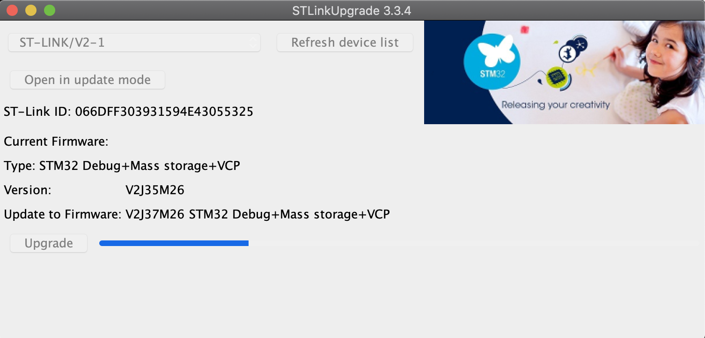

STM32 F407 Discovery LLライブラリを使って タイマ割り込み（TIM）
===

STM32の開発には、STマイクロエレクトロニクス提供のライブラリを使うのが効率的とされており、現在は LL API（Low-Layer Application Programming Interface）ソフトウェアが無償提供されています。  
さらに STM32CubeIDE という開発環境 (IDE) も同様に無償で使えるため、STM32CubeIDE と LL を使って開発します。

使用するハードウェアは STM32F4DISCOVERY です。  
秋月電子やRSコンポーネンツで 3000円程度 で購入できます。

# 解説内容

周期的なタイマ割り込みの使い方を解説します。  
STM32でタイマ割り込みを使うには、SysTick と TIM を使う方法の２つがありますが、この記事では TIM の使い方を解説します。  
（SysTick は簡単に使えますが、 FreeRTOS との共存が非推奨なため）

# 用意するもの

* [STM32F4DISCOVERY](https://www.st.com/ja/evaluation-tools/stm32f4discovery.html)
* USB mini-B ケーブル

# 開発環境

* MacBook Pro (13-inch, 2019, Four Thunderbolt 3 ports)  
* macOS Catalina バージョン 10.15.6
* [STM32CubeIDE](https://www.st.com/ja/development-tools/stm32cubeide.html) Version: 1.4.0


STM32CubeIDE のインストールには、STマイクロエレクトロニクスへのアカウント登録（無料）が必要です。  
インストーラを実行するだけで簡単にインストールできます。

# ソフトウェア開発手順

## コーディング前の準備

STM32CubeIDE を起動すると以下の画面が開きます。  
画面左の C/C++ Projects で右クリックし、 [New] → [STM32 Project] を選択します。


マイコンの種類を選択する画面が開きます。  
上バーから Board Selector を選び、 Commercial Part Number で STM32F407G-DISC1 を選択します。  
画面右にボードの写真が出てくるので選択し、右下の Next を押します。

 

Project Name を入力し、 Finish を押します。


今回は No を選択します。  
（Yes を選択した方が楽なこともありますが勉強のため。）


マイコンのピンアサイン画面が開きます。


左蘭の [System Core] → [RCC] を選択します。  
High Speed Clock (HSE) を Crystal/Ceramic Resonator にします。  
F4Discoveryには 8MHz のオシレーターが付いているので、これを使うための設定です。  


上タブの Clock Configuration を選択します。

本マイコンは 最大168MHz で動作します。  
また前述したとおり 8MHz のオシレーターが付いていますので、これを入力として逓倍と分周をして 168MHz を作り出すように設定します。  

以下画像のように設定してください。

それとタイマーのクロックが次のように設定されることを覚えておいてください。
* APB1 Timer clocks (MHz)  84
* APB2 Timer clocks (MHz) 168


上タブの Pinout & Configuration を選択します。  
左蘭の [Timers] → [TIM1] を選択します。  

パラメータを以下のように設定してください。

今回は 500ミリ秒ごとに（2Hz） タイマ割り込みが発生するようにします。  
TIM1 は APB2 ですので先に設定した 168MHz を基準として動作します。

||動作周期|TIM|
|:---|:---|:---|
|APB1|84 MHz|TIM2, TIM3, TIM4, TIM5, TIM6, TIM7, TIM12, TIM13, TIM14|
|APB2|168 MHz|TIM1, TIM8, TIM9, TIM10, TIM11|

割り込み周期を設定するには以下の式になるように、オートリローダ と プリスケーラ を設定します。

```
（オートリローダ + 1）×（プリスケーラ + 1）= 動作周期 / 分周比 / 割り込み周期[Hz]

(9999 + 1) × (8399 + 1) = 168,000,000 / 1 / 2 = 84,000,000
```


NVIC Settings を選択し、 TIM1 Update Interrupt and TIM10 global Interrupt にチェックを入れます。  
これによって周期的にタイマ割り込みが発生するようになります。


上タブの Project Maneger を選択します。  
次に左タブの Advanced Settings を選択します。

GPIO、RCC がデフォルトだと HAL となっていますが、 本記事は LL の使い方解説なので LL を選択します。


以上が設定できたら、 ioc ファイルを保存してください。  
保存すると自動的に C言語のファイル等必要なものが生成されます。

以上でコーディング前の準備は完了です。

## コーディング

Core/Src/main.c の MX_TIM1_Init に以下を追記してください。

```main.c
/* USER CODE END TIM1_Init 1 */
TIM_InitStruct.Prescaler = 8399;
TIM_InitStruct.CounterMode = LL_TIM_COUNTERMODE_UP;
TIM_InitStruct.Autoreload = 9999;
TIM_InitStruct.ClockDivision = LL_TIM_CLOCKDIVISION_DIV1;
TIM_InitStruct.RepetitionCounter = 0;
LL_TIM_Init(TIM1, &TIM_InitStruct);
LL_TIM_DisableARRPreload(TIM1);
LL_TIM_SetClockSource(TIM1, LL_TIM_CLOCKSOURCE_INTERNAL);
LL_TIM_SetTriggerOutput(TIM1, LL_TIM_TRGO_RESET);
LL_TIM_DisableMasterSlaveMode(TIM1);
/* USER CODE BEGIN TIM1_Init 2 */
// 【追記開始】
LL_TIM_EnableCounter(TIM1);
LL_TIM_EnableIT_UPDATE(TIM1);
// 【追記終了】
/* USER CODE END TIM1_Init 2 */
```

Core/Src/stm32f4xx_it.c の TIM1_UP_TIM10_IRQHandler に以下を追記してください。

```stm32f4xx_it.c
void TIM1_UP_TIM10_IRQHandler(void)
{
  /* USER CODE BEGIN TIM1_UP_TIM10_IRQn 0 */
  // 【追記開始】
  if (LL_TIM_IsActiveFlag_UPDATE(TIM1)) {
    LL_TIM_ClearFlag_UPDATE(TIM1);
    LL_GPIO_TogglePin(LD3_GPIO_Port, LD3_Pin);
    LL_GPIO_TogglePin(LD4_GPIO_Port, LD4_Pin);
    LL_GPIO_TogglePin(LD5_GPIO_Port, LD5_Pin);
    LL_GPIO_TogglePin(LD6_GPIO_Port, LD6_Pin);
  }
  // 【追記終了】
  /* USER CODE END TIM1_UP_TIM10_IRQn 0 */

  /* USER CODE BEGIN TIM1_UP_TIM10_IRQn 1 */

  /* USER CODE END TIM1_UP_TIM10_IRQn 1 */
}
```

以上でコーディングは完了です。

## 実行する

STM32F4Discovery を USBケーブル で PC に繋いでください。

メニューバーから [Run] → [Debug] を選択します。  


右下の OK を押します。


STM32F4Discovery に搭載されている ST-Link（JTAG）のバージョンが古いと以下画面が出るので最新にアップデートしてください。  
アップデート完了したら上記手順に戻り再度実行します。



main関数の先頭で止まるので、左上の三角ボタンを押して続きを実行してください。  
（一行ずつのステップ実行なども可能です）


うまくいけば、以下のように4つのLEDが 500ミリ秒周期で 点滅します。


以上で実行完了です。

# ソースコード一式

https://github.com/hiroshi-mikuriya/f407_TIM

# 参考

STマイクロエレクトロニクスのサンプルコード、および STM32CubeIDE が自動生成するコードを元に本記事を作成しています。